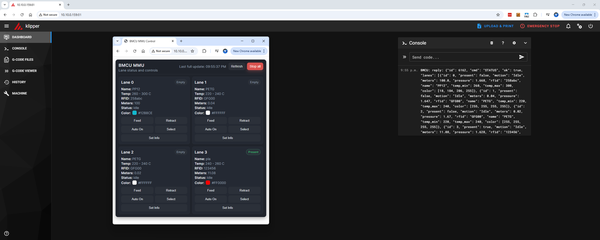

# BMCU370 - Klipper Edition

A custom MMU (Multi-Material Unit) firmware for the BMCU Xing-C hardware, focused on **Klipper integration**.



---

## Origins & Compatibility Notice

This project is a fork of the original [BMCU370x by Xing-C](https://github.com/Xing-C/BMCU370x).

> [!WARNING] > **This firmware is NOT compatible with the original BMCU project.**
>
> This version has been completely refactored with a new architecture, English codebase, and a primary focus on Klipper support. If you need BambuBus/printer compatibility, please use the original project instead.

### What's Different?

- Complete code refactoring and English translation
- Abstracted command routing architecture
- Native Klipper support via JSON serial protocol
- Modular HAL (Hardware Abstraction Layer) design

---

## Installation

### 1. Flash the Firmware

Use PlatformIO to build and flash the firmware to your BMCU hardware:

```bash
pio run -t upload
```

### 2. Klipper Configuration

Copy the Klipper plugin files to your Klipper installation:

| File                      | Destination                |
| ------------------------- | -------------------------- |
| `Klipper/bmcu.py`         | `~/klipper/klippy/extras/` |
| `Klipper/bmcu_macros.cfg` | `~/printer_data/config/`   |
| `Klipper/bmcu_card.html`  | `~/mainsail/`              |

### 3. printer.cfg Setup

Add the following to your `printer.cfg`:

```ini
[include bmcu_macros.cfg]

[bmcu]
serial: /dev/serial/by-id/usb-YOUR_BMCU_SERIAL_ID
baud: 115200
```

Replace `YOUR_BMCU_SERIAL_ID` with the actual serial ID of your BMCU device. You can find it by running:

```bash
ls /dev/serial/by-id/
```

### 4. Restart Klipper

```bash
sudo systemctl restart klipper
```

### 5. Access BMCU Web Interface

```bash
http://<MAINSAIL_IP>/bmcu_card.html
```

---

## Links

- **Original Project**: https://github.com/Xing-C/BMCU370x
- English wiki: https://wiki.yuekai.fr/
- Chinese wiki: https://bmcu.wanzii.cn/

---

## Changelog

### 2025-12-25 — Version 0020_A1 (Klipper Edition)

- Complete refactoring of the codebase
- English code translations
- Abstraction of the command routing logic
- Native Klipper support via JSON serial protocol
- Modular HAL design for hardware abstraction
- LiteJSON library for efficient embedded JSON parsing

---

### Historical Changes (Original Project)

<details>
<summary>Click to expand previous versions</summary>

#### 2025-07-17 — Version 0020

- Fixed an error in the lighting logic that caused some states to have no indicator lights.
- Fixed channels coming online unexpectedly.
- Fixed the anti-disconnect logic, which previously was not actually effective.
- Rewrote the lighting system:
  - Fixed flickering issues.
  - Reduced the refresh rate.
- When a channel is in an error state, the red indicator is retried every 3 seconds.

#### 2025-07-06 — Version 0019 (Modified)

- Dual micro-switch Hall version is also supported.

#### Changes in original 0019 compared to original 0013

- P1X1 can now support 16 colors.
- Fixed an issue where filament information could not be saved.
- Modified online logic checks.
- Modified motor control logic for high-voltage and low-voltage conditions.

</details>

---

## License

This project is licensed under the GPL-3.0 License - see the [LICENSE](LICENSE) file for details.
